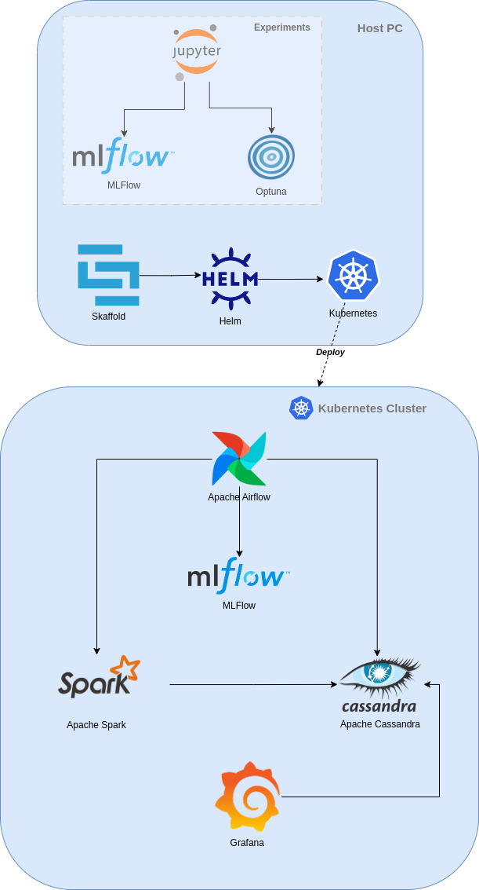

# Price Oracle

Price Oracle is an end-to-end solution for monitoring and predicting the price of criptocurrencies.  
It is composed data ingestion pipelines leveraging Apache Airflow, a data lake built on top of Apache Cassandra, machine learning models built with TensorFlow and a front-end built with Grafana.  
The automated data ingestion pipelines provide real-time data, which are used to train the machine learning models and to provide real-time predictions.

## Data
## Clustering
## Modeling
### Optuna

## Architecture

Price Oracle is developed in a fully containerized environment leveraging Docker, Kubernetes and Helm.

### Docker

Docker is a technology that allows to package an application with all of its dependencies into a standardized unit for software development.  
This allows for complete reproducibility of the application, regardless of the environment in which it is run.  

### Kubernetes

Kubernetes is an open-source container-orchestration system for automating computer application deployment, scaling, and management.  
Paired with Docker, it allows to deploy and manage containers in a cluster of machines.  
It allows for abracting away the infrastructure and managing things like networking, storage, load balancing, etc.

### Helm

Helm is a package manager for Kubernetes.
Helm charts are used to define, install, and upgrade Kubernetes applications.
Many Helm charts are available for common applications, such as Apache Airflow, Apache Cassandra, Apache Spark, Grafana, etc.

### Skaffold

Skaffold is a command line tool that facilitates continuous development for Kubernetes applications.  
It handles the workflow for building, pushing and deploying applications.

In the Price Oracle project, Skaffold uses the Helm charts to deploy the applications on the Kubernetes cluster.

### Kind

Kind is a tool for running local Kubernetes clusters using Docker container “nodes”.  
It allows to run a Kubernetes cluster on a single machine, which is useful for development and testing.  
For this project, it is used to run a local Kubernetes cluster on the developer's machine.  

### Apache Airflow

Apache Airflow is an open-source workflow management platform.  
It allows to define, schedule and monitor workflows, which are defined as DAGs (Directed Acyclic Graphs).  
DAGs can be used to define data ingestion pipelines, which are used to ingest data from different sources and store them in a data lake.  
DAGs can also be used to train machine learning models and to provide real-time predictions.  

### Apache Cassandra

Apache Cassandra is a free and open-source, distributed, wide column store, NoSQL database management system.  
In the Price Oracle project, it is used as a data lake to store the data ingested by the data ingestion pipelines.  
It also stores the machine learning models predictions and metrics.

### Apache Spark

Apache Spark is an open-source unified analytics engine for large-scale data processing.  
In the Price Oracle project, it is used to compute some indicators on the data stored in the data lake.  

### Grafana
Grafana is an open-source analytics and monitoring solution.  
In the Price Oracle project, it is used to visualize the data stored in the data lake and the machine learning models predictions.  

## DAGs

## Dashboards